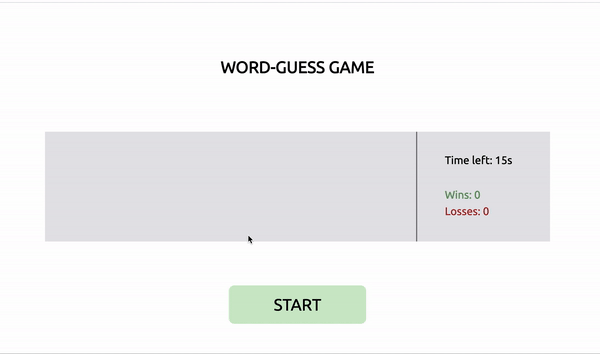

# Word Guess Game
This project is to create a word guess game. Players must guess all the words correctly in the limited time to win the game!

## Getting Started
```console
git clone https://github.com/qtian13/word-guess.git
```

## Built With
* [HTML](https://developer.mozilla.org/en-US/docs/Web/HTML)
* [CSS](https://developer.mozilla.org/en-US/docs/Web/CSS)

## Description of the Password Generator
1. There is 4 parts on the web page: the game name, word display area, results of the game and a `start` button;
1. When the page load, the results will be reset
1. When the player click `start` button, new round of guess start. The results stay the same
1. The time left for the game is displayed above the result
1. Players win when they guess all the words correctly in the given time and the number of wins increases by 1
1. If players fail to finish the guess within the limited time, they loses the game and the number of losses increase by 1 

## Page URL
https://qtian13.github.io/word-guess/

## Application Demo


## Author
Qiushuang Tian
- [Link to Portfolio Site](https://qtian13.github.io/)
- [Link to Github](https://github.com/qtian13)
- [Link to LinkedIn](https://www.linkedin.com/in/qiushuang-tian-a9754248/)

## Acknowledgments
- [Berkeley Coding Boot Camp](https://bootcamp.berkeley.edu/coding/) provided demo gif

